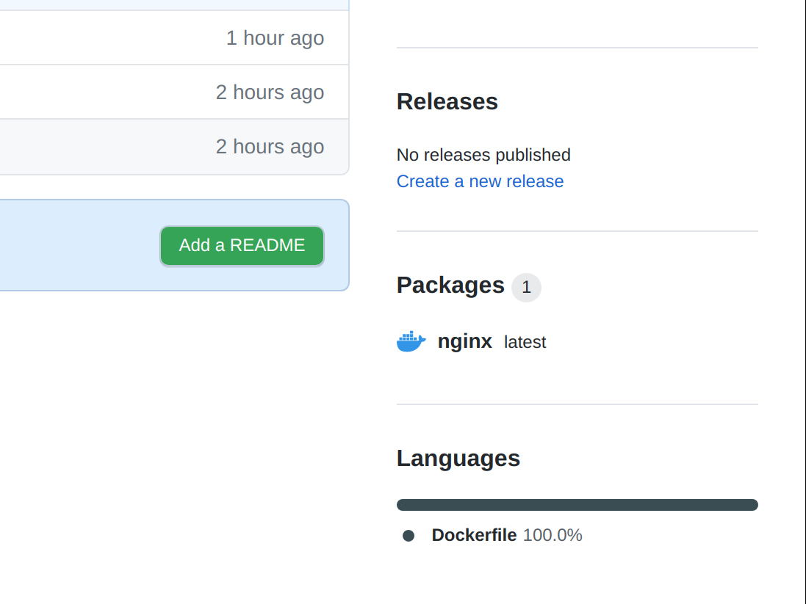
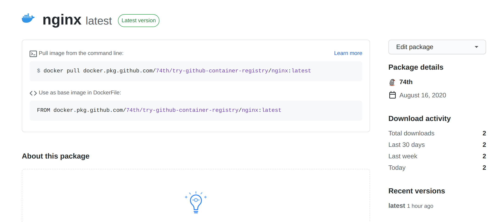

# Github Packages を Docker Registry として使う

## tl;dr

- Github Packages は Docker Registry として利用でき、リポジトリと同一の権限管理ができて便利である。
- タグは `docker.pkg.github.com/USER/REPOSITORY/IMAGE:TAG` となり、リポジトリに複数のイメージを登録できる。
- 公開リポジトリであってもアクセストークンの登録が必要である。 `docker login https://docker.pkg.github.com -u <User Name> --password <Access Token>`

## 実際どんな感じになるか

Github Packages を使うと、成果物のリソースの管理が Github Repository の管理と一致するため、非常に便利です。
Github Packages は Docker Registry としても使える機能を持っています。
すなわち、Github Repository の権限管理の Docker Registry として使うことができる。

以下のようなイメージの名前の docker registry として使えます。リポジトリに複数のイメージを格納できます。

`docker.pkg.github.com/USER/REPOSITORY/IMAGE:TAG`





## ローカルの docker コマンドで使う

docker コマンドで github package にアクセスするには、公開リポジトリの公開パッケージであったとしても、必ず Personal Access Token を使ってログインすることが必要です。
加えて、Personal Access Token には、以下の権限が必要です。

- docker pull する場合 "read:packages"
- docker push する場合 "write:packages"

以下のコマンドでログインを行います。

```
docker login https://docker.pkg.github.com -u 74th --password <Access Token>
```

```
docker.pkg.github.com/USER/REPOSITORY/IMAGE:TAG
```

このリポジトリの nginx の例

```
docker run --rm -it -p 80:80 docker.pkg.github.com/74th/try-github-container-registry/nginx:latest
```

## Github Action でビルドする

`${{ secrets.GITHUB_TOKEN }}`でアクセストークンが得られるので、これを使うように[Build and push Docker images](https://github.com/marketplace/actions/build-and-push-docker-images)の Github Action を組みます。

```yaml
name: docker-build

on:
  push:
    branches:
      - master

jobs:
  build:
    name: build
    runs-on: ubuntu-20.04
    steps:
      - name: Checkout code
        uses: actions/checkout@v2

      - name: Build and push Docker images
        uses: docker/build-push-action@v1.1.0
        with:
          registry: docker.pkg.github.com
          username: 74th
          password: ${{ secrets.GITHUB_TOKEN }}
          dockerfile: ./Dockerfile
          repository: 74th/try-github-container-registry/nginx
          tags: latest
```

## Kubernetes で使う

```
kubectl create secret docker-registry regcred --docker-server=docker.pkg.github.com --docker-username=74th --docker-password=f930a748668d1dac8ce69e13cf4ef6e9cb284772 --docker-email=site@74th.tech
```
